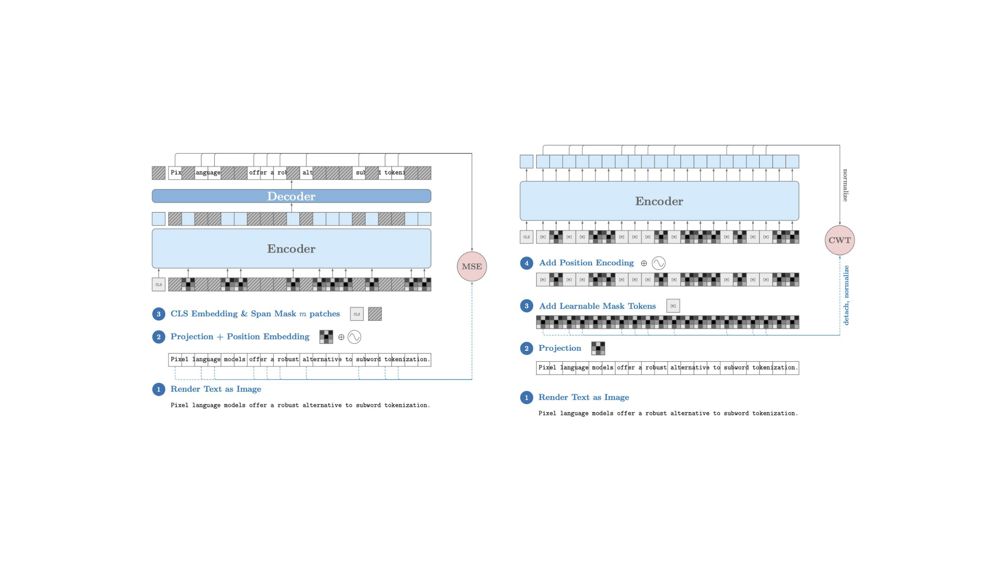
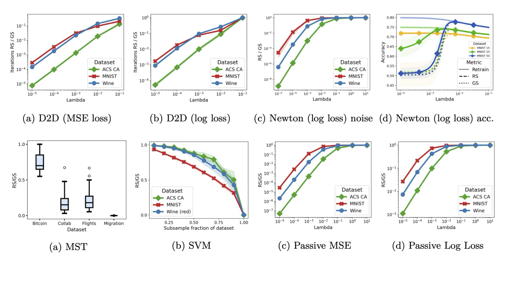
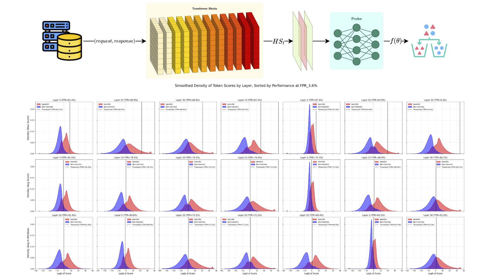

# Research

## 2026

    

        
    

    

        <h3 class="publication-title">
            <a href="https://drive.google.com/file/d/1utY01Cq0Kl6eUfCEWQ4XWtMSmbHglR7q/view?usp=share_link" class="publication-link">
                Headless PIXEL language modeling
            </a>
        </h3>
        
Preprint

        
Kasra Malihi

        
2026

        

            LM Pre-training
            Tokenization-free
            <!-- <a href="https://arxiv.org/abs/2602.09987" class="tag tag-arxiv">ARXIV</a>
            <a href="https://github.com/jrosseruk/infusion" class="tag tag-github">GITHUB</a> -->
        

        

            

                Abstract
                <svg fill="none" stroke="currentColor" viewBox="0 0 24 24" xmlns="http://www.w3.org/2000/svg">
                    <path stroke-linecap="round" stroke-linejoin="round" stroke-width="2" d="M19 9l-7 7-7-7"></path>
                </svg>
            

            
 Pixel-based language models offer a robust alternative to subword tokenization by processing text directly as rendered images, effectively bypassing vocabulary bottlenecks and multilingual constraints. However, most of the existing visual language pre-training methods rely heavily on Masked Autoencoder (MAE) architectures with Mean Squared Error (MSE) objective. We argue that exact pixel reconstruction does not necessarily correlate with effective language modeling; forcing a model to perfectly redraw text discards the semantic uncertainty that is fundamental to language understanding. Furthermore, MSE exhibits severe mathematical and structural limitations in this domain. It is highly brittle to minor spatial translations, where even a one-pixel shift yields massive error penalties. Unlike standard computer vision models that mitigate such sensitivities through spatial augmentations (e.g., cropping and flipping), rendered text cannot be naturally subjected to these perturbations without destroying readability. To address these vulnerabilities, we explore a self-supervised contrastive approach for pixel-based language modeling. Building upon the Headless Language Model framework, we transition away from the MSE reconstruction paradigm in favor of optimizing the Vision Transformer encoder directly via Contrastive Weight Tying (CWT). Empirical evaluations demonstrate that our encoder-only architecture achieves 74.8% downstream accuracy, while the variant retaining the decoder yields 75.8%.

        

    

    

        
    

    

        <h3 class="publication-title">
            <a href="https://arxiv.org/abs/2603.03172" class="publication-link">
                Less Noise, Same Certificate: Retain Sensitivity for Unlearning
            </a>
        </h3>
        
ICML 2026 under review

        <a href="https://tpdp.journalprivacyconfidentiality.org" class="publication-venue">TPDP 2026</a>
        
Carolin Heinzler, Kasra Malihi, Amartya Sanyal

        
2026

        

            Unlearning
            Certified Machine Learning
            <a href="https://arxiv.org/abs/2603.03172" class="tag tag-arxiv">ARXIV</a>
            <!-- <a href="https://github.com/J-Rosser-UK/AgentBreeder" class="tag tag-github">GITHUB</a> -->
        

        

            

                Abstract
                <svg fill="none" stroke="currentColor" viewBox="0 0 24 24" xmlns="http://www.w3.org/2000/svg">
                    <path stroke-linecap="round" stroke-linejoin="round" stroke-width="2" d="M19 9l-7 7-7-7"></path>
                </svg>
            

            
Certified machine unlearning aims to provably remove the influence of a deletion set <em>U</em> from a model trained on a dataset <em>S</em>, by producing an unlearned output that is statistically indistinguishable from retraining on the retain set <em>R := S \ U</em>. Many existing certified unlearning methods adapt techniques from Differential Privacy (DP) and add noise calibrated to global sensitivity, i.e., the worst-case output change over all adjacent datasets. We show that this DP-style calibration is often overly conservative for unlearning, based on a key observation: certified unlearning, by definition, does not require protecting the privacy of the retained data <em>R</em>. Motivated by this distinction, we define retain sensitivity as the worst-case output change over deletions <em>U</em> while keeping <em>R</em> fixed. While insufficient for DP, retain sensitivity is exactly sufficient for unlearning, allowing for the same certificates with less noise. We validate these reductions in noise theoretically and empirically across several problems, including the weight of minimum spanning trees, PCA, and ERM. Finally, we refine the analysis of two widely used certified unlearning algorithms through the lens of retain sensitivity, leveraging the regularity induced by <em>R</em> to further reduce noise and improve utility.

        

    

## 2025

    

        
    

    

        <h3 class="publication-title">
            <a href="https://arxiv.org/abs/2603.03172" class="publication-link">
                Hidden State Analysis for LLM Adversarial Defense: A Layer-wise Approach to Representation Engineering
            </a>
        </h3>
        
BSc Thesis

        
Kasra Malihi, Mahdieh Soleymani Baghshah

        
2025

        

            LLM safety alignment
            <!-- <a href="https://arxiv.org/abs/2603.03172" class="tag tag-arxiv">ARXIV</a> -->
            <!-- <a href="https://github.com/J-Rosser-UK/AgentBreeder" class="tag tag-github">GITHUB</a> -->
        

        

            

                Abstract
                <svg fill="none" stroke="currentColor" viewBox="0 0 24 24" xmlns="http://www.w3.org/2000/svg">
                    <path stroke-linecap="round" stroke-linejoin="round" stroke-width="2" d="M19 9l-7 7-7-7"></path>
                </svg>
            

            
Large Language Models have emerged as powerful tools, revolutionizing various domains with their advanced Natural Language Processing capabilities. Their increasing integration into critical applications, however, necessitates robust safety mechanisms to ensure their reliable and ethical deployment.
            Despite their transformative potential, LLMs are highly susceptible to a growing array of Adversarial Attacks, including sophisticated Jailbreaks, prompt injection, and data poisoning. This dynamic and evolving threat landscape poses a significant challenge to maintaining the integrity, trustworthiness, and beneficial operation of these models in real-world environments.
            This thesis aims to address the critical problem of enhancing LLM safety and robustness against these persistent adversarial threats. Our primary goal is to develop and understand a novel defense mechanism by focusing on the potential of Representation Learning within LLMs.
            In this research, the proposed method of layer-wise representation reading and engineering was presented, consisting of two stages: probing the model’s layers using a neural network and engineering promising layers through parameter-efficient fine-tuning. The proposed method was evaluated on the HarmBench dataset. Results showed that the proposed method achieved an accuracy of 84.98%, outperforming reference methods.

        

    

