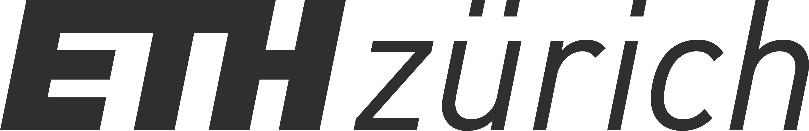
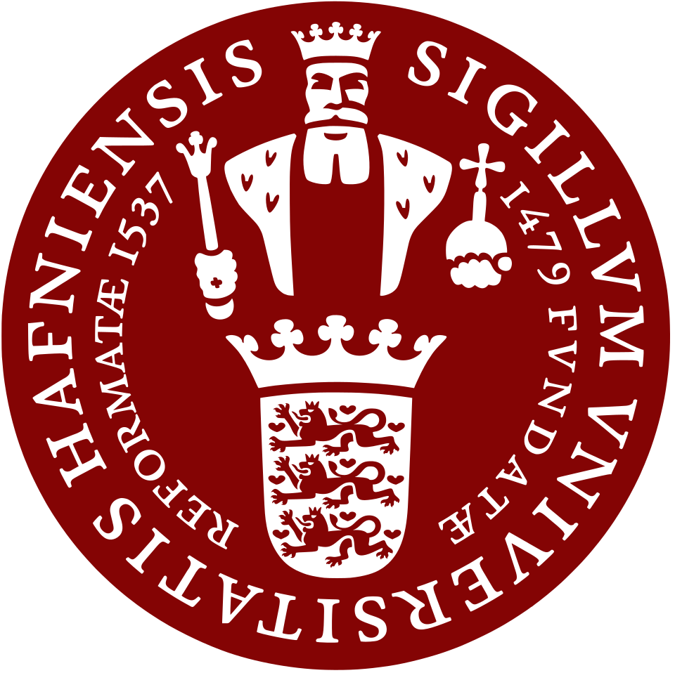
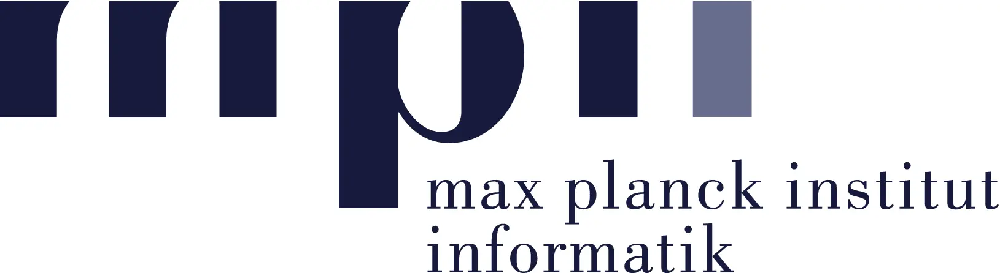

# Résumé

  
  

    

      
    

    

      

        ETH Zurich
        M.Sc. in Computer Science
        Sep 2026 – <strong class="text-accent">Present</strong>
      

      
Exchange Student

    

  

    
    

      

        
      

      

        

          University of Copenhagen
          M.Sc. in Computer Science
          Sep 2025 – Sep 2026
        

        <!-- 
Copenhagen, DK
 -->
        <!-- 
Exploring Theoretical ML and NLP.
 -->
      

    

  

  

    
    

      

        
      

      

        

          Max Planck Institute for Informatics
          Undergraduate Research Intern, AIDAM Group
          Jul 2023 – Sep 2023
        

        <!-- 
Saarbrücken, DE
 -->
        <!-- 

 -->
      

    

  

  

    
    

      

        
      

      

        

          Sharif University of Technology
          B.Sc. in Computer Engineering
          Oct 2020 – Feb 2025
        

        
Thesis: Hidden State Analysis for LLM Adversarial Defense: A Layer-wise Approach to Representation Engineering

      

    

  
